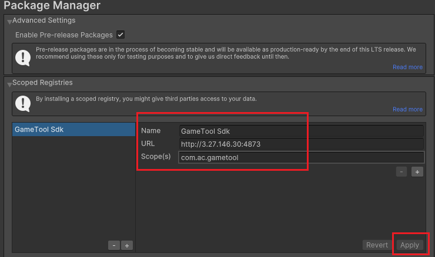
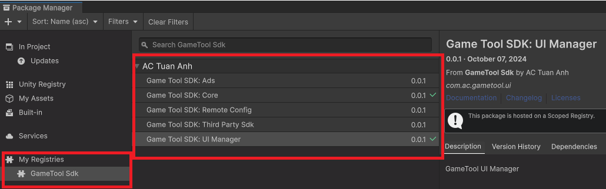
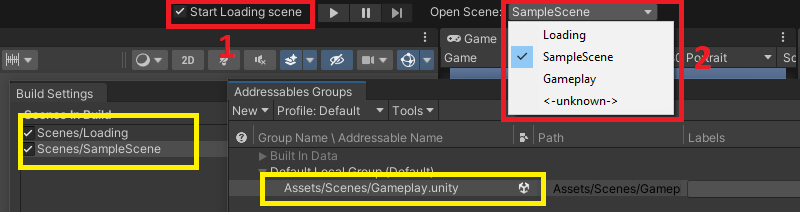
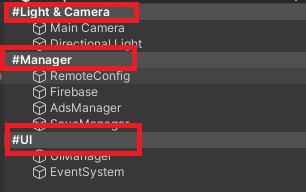
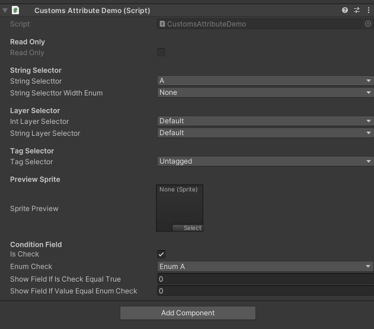
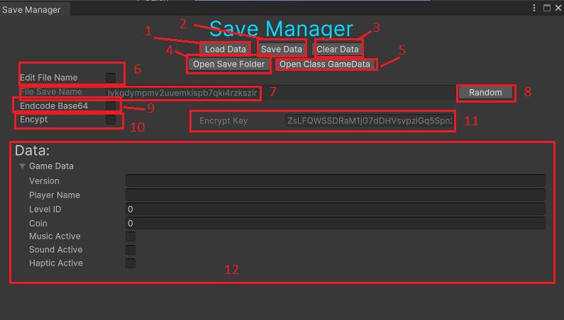
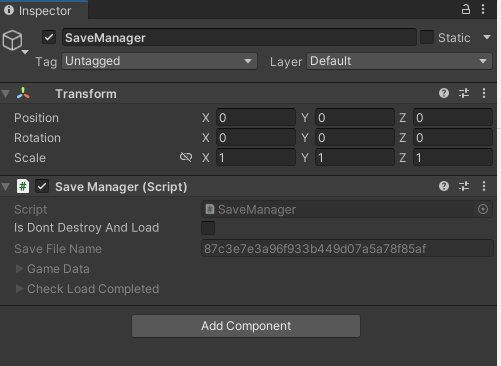
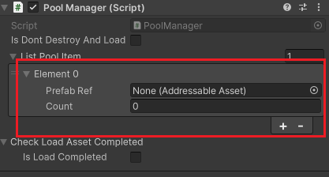

# Hướng dẫn tích hợp Sdk

## Thêm package vào project

### Thêm Scoped Registry

-   Try cập vào menu Edit -\> Project Settings -\> Package Manager.
-   Thêm New Scoped Registry:

    Name: *GameTool Sdk*

    URL: <http://3.27.146.30:4873/>

    Scope(s): *com.ac.gametool*

-   Bấm Apply để thêm Registry

    **

### Thêm Package

-   Vào menu Window -\> Package Manager -\> My Registries -\> *GameTool Sdk*.
-   Install package: *Game Tool SDK: Core*. 

# Hướng dẫn sử dụng

## Truy cập scene nhanh



-   (1) Khi Play Editor sẽ load và chạy Scene với index 0 trong Build Settings.
-   (2) Hiển thị các scene có trong Build Settings và Addressables. Chọn các scene để mở nhanh các scene.

## Phân cách và hightlight các phần trong Hierarchy



Thêm \# trước tên GameObject để Hightlight GameObject

## Custom Attribute

-   Compoment CustomsAttributeDemo:

```C#
using UnityEngine;
using AC.GameTool.Attribute;

public class CustomsAttributeDemo : MonoBehaviour
{
    public enum EnumTypeDemo
    {
        None,
        EnumA,
        EnumB,
        EnumC
    }
    [Header("Read Only")]
    [ReadOnly]
    public bool ReadOnly;
    [Header("String Selector")]
    [StringSelector("A", "B", "C")]
    public string StringSelecttor;
    [StringSelector(typeof(EnumTypeDemo))]
    public string StringSelecttorWidthEnum;
    [Header("Layer Selector")]
    [LayerSelector]
    public int IntLayerSelector;
    [LayerSelector]
    public string StringLayerSelector;
    [Header("Tag Selector")]
    [TagSelector]
    public string TagSelector;
    [Header("Preview Sprite")]
    [PreviewSprite]
    public Sprite SpritePreview;
    [Header("Condition Field")]
    public bool IsCheck;
    public EnumTypeDemo EnumCheck;

    [ConditionField("IsCheck")]
    public int ShowFieldIfIsCheckEqualTrue;
    [ConditionField("EnumCheck", false, EnumTypeDemo.EnumA, EnumTypeDemo.EnumB)]
    public int ShowFieldIfValueEqualEnumCheck;
}
```

-   Inspector Preview

    

# Save Manager

### SaveManager Editor

-   Vào menu GameTool -\> Save Manager

    

    (1): Load lại Data Game.

    (2): Lưu lại Data Game.

    (3): Xoá Data Game.

    (4): Mở thư mục chứa file Save

    (5): Mở class GameData để chỉnh sửa.

    (6): Tích chọn để thay đổi tên file Save.

    (7): Tên file save

    (8): Thay đổi random tên file save.

    (9): Tích để lưu data game dưới dạng base64

    (10): Tích để lưu datagame bằng mã hoá AES

    (11): Key để mã hoá/giải mã Data Game(thay đổi or để trống để tạo key ngẫu nghiên)

    (12): Hiển thị data save đã lưu.

### Thay đổi Data Game

Mở class GameData bằng 2 cách sau:

-   Cách 1: Vào menu GameTool-\>Save Manager-\> Open Class GameData.
-   Cách 2: Mở file Asset/AC Tuan Anh/SaveManager/GameData.cs

```C#
namespace AC.GameTool.SaveData
{
    public partial struct GameData
    {
        public string Version;
        public string PlayerName;
        public int LevelID;
        public int Coin;
        public bool MusicActive;
        public bool SoundActive;
        public bool HapticActive;
    }
}
```

### Cách sử dụng

-   Thêm 1 GameObject vào Hierarchy. Thêm compoment SaveManager vào GameObject. Hãy chắc chắn CheckLoadCompleted.IsLoadCompleted = true trước khi load/save data game. Thường GameObject sẽ để ở load scene.
-   Đọc và thay đổi Game Data.

Ví dụ: Về đọc và đổi tên của Player

```C#
using AC.GameTool.SaveData;
using UnityEngine;

public class ReadAndChangeGameDataDemo : MonoBehaviour
{
    // Start is called before the first frame update
    void Start()
    {
        GameData gameData = SaveManager.Instance.GameData;
        string playerName = gameData.PlayerName;
        Debug.Log(playerName);
        gameData.PlayerName = "New Player Name";
        SaveManager.Instance.GameData = gameData;
    }  
}
```

## Pool Manager

### Hướng dẫn sử dụng

-   Thêm 1 GameObject vào Hierarchy. Thêm compoment PoolManager vào GameObject. Hãy chắc chắn CheckLoadAssetCompleted.IsLoadCompleted = true trước khi spawn Object. Thường GameObject sẽ để ở load scene.
-   Thêm Pool Object. Kéo Object Prefab vào ListPoolItem và nhập số lượng khởi tạo object ban đầu.

    
