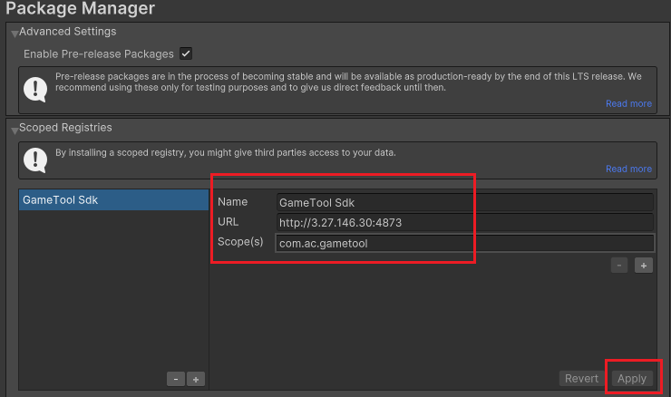
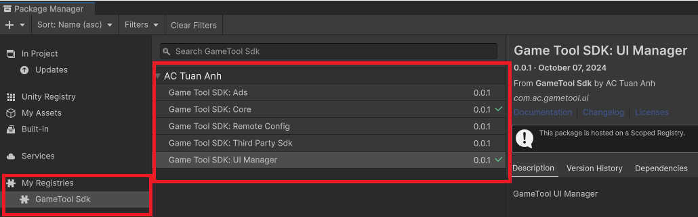

# Hướng dẫn tích hợp Sdk

## Thêm package vào project

### Thêm Scoped Registry

-   Try cập vào menu Edit -\> Project Settings -\> Package Manager.
-   Thêm New Scoped Registry:

    Name: *GameTool Sdk*

    URL: <http://3.27.146.30:4873/>

    Scope(s): *com.ac.gametool*

-   Bấm Apply để thêm Registry

    **

### Thêm Package

-   Vào menu Window -\> Package Manager -\> My Registries -\> *GameTool Sdk*.
-   Thêm các package cần thiết.

    
